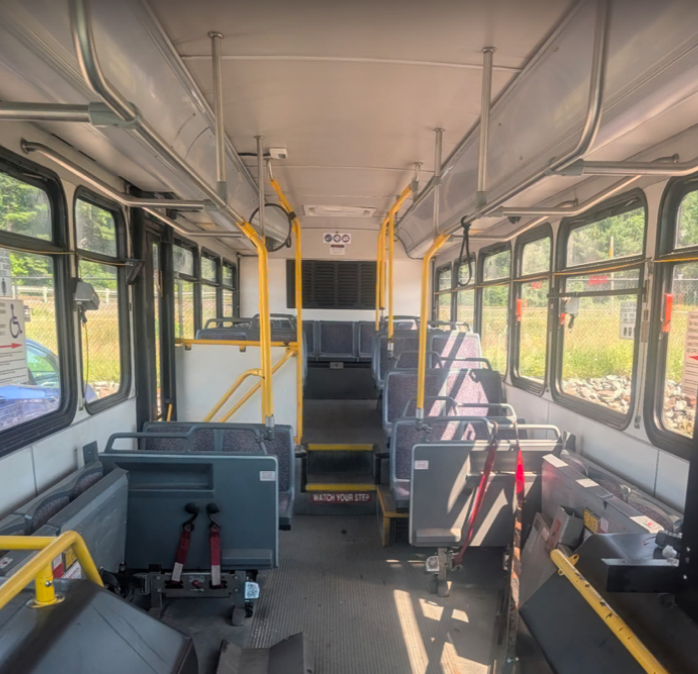

# Great Falls Tool Bus

> [greatfallstoolbus.org](https://greatfallstoolbus.org/)

**Do you know how big a bus is?**

## We won the bus! 🚌

## Interest form

Built by a community volunteer: https://forms.gle/PsyjstN4MgKhm5H8A

## Contributing

Read [CONTRIBUTING.md](https://github.com/Great-Falls-Tool-Bus/.github/blob/main/CONTRIBUTING.md).
Work from a fork and install the shared hooks:

    gh repo fork Great-Falls-Tool-Bus/<repo> --clone --remote
    cd <repo>
    just setup

## Reach the project

[greatfallstoolbus.org/contact](https://greatfallstoolbus.org/contact)

---

Infrastructure, build systems and engineering provided by Tinyland, Inc. and RNA Services.
